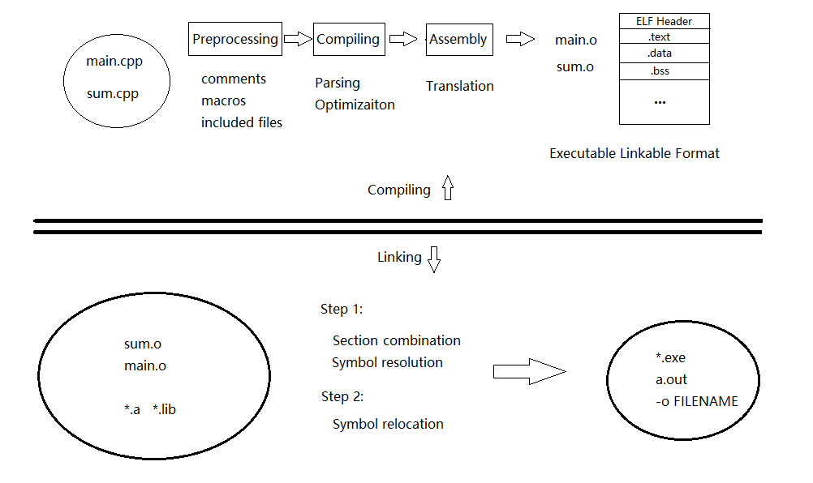
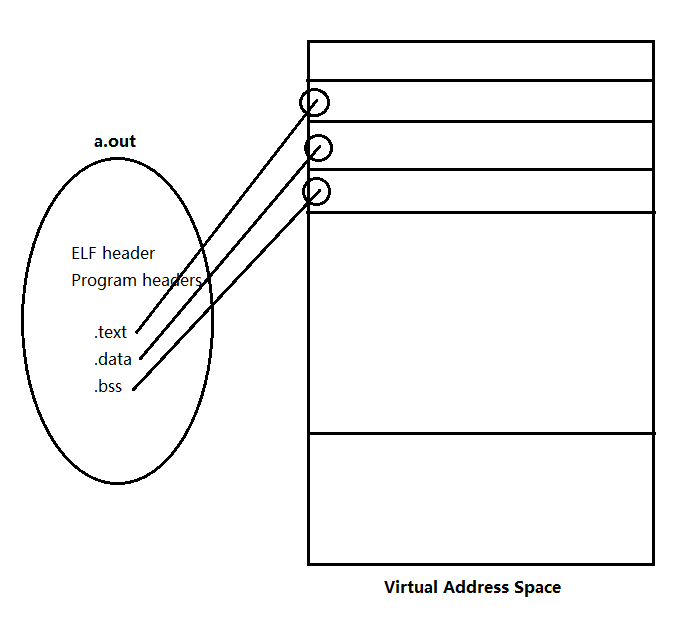

# Program Compiling and Linking



We all know that we need to compile the source file to an executable program for the machine to run, but what exactly happened? A modern compiler does most of the work for programmers and make life much easier, but it is important for us to understand what's going on out of our sight. Let's start from these two functions from two separate files.

**sum.cpp**

```c++
int gdata = 10;

int sum(int a, int b) {
    return a + b;
}
```

**main.cpp**

```cpp
extern int gdata;
int sum(int, int);

int data = 20;

int main() {
    int a = gdata;
    int b = data;
    int ret = sum(a, b);
    return 0;
}
```

## Compiling

### Preprocessing

The first step is to handle the preprocessor directives that begin with #, for example #include and #define. This includes comments removing, macros expanding and included files expanding. Notice that directive #pragma is not processed here, for it includes the linking of libraries.

### Compiling

The compiling step is performed on the output of the preprocessor. The compiler parse the C++ source code into assembly file. Various optimization techniques are performed as well, which is an important criterion for the performance of the compiler.

### Assembly

In this step, the compiler translate the assembly code into machine code, which is represented as an Relocatable Object File. This object file contains an ELF (Executable Locatable File) header and several sections, including *.text*, *.rodata*, *.data*, *.bss* and *.symtab*, a symbol table. 

The ELF headed stores information of this file, helping the linker to parse and explain the target file.

*.text*, *.rodata*, *.data*, *.bss* is similar to those we have seen in the process virtual address space, which refers to commands and data.

The symbol table stores symbols of the declarations and definitions of global variables and functions in our file. We can use ```objdump -t main.o``` to see the symbol table of our main() function.

```shell
main.o:     file format elf64-x86-64

SYMBOL TABLE:
0000000000000000 l    df *ABS*  0000000000000000 main.cpp
0000000000000000 l    d  .text  0000000000000000 .text
0000000000000000 l    d  .data  0000000000000000 .data
0000000000000000 l    d  .bss   0000000000000000 .bss
0000000000000000 l    d  .note.GNU-stack        0000000000000000 .note.GNU-stack
0000000000000000 l    d  .eh_frame      0000000000000000 .eh_frame
0000000000000000 l    d  .comment       0000000000000000 .comment
0000000000000000 g     O .data  0000000000000004 data
0000000000000000 g     F .text  0000000000000033 main
0000000000000000         *UND*  0000000000000000 gdata
0000000000000000         *UND*  0000000000000000 _GLOBAL_OFFSET_TABLE_
0000000000000000         *UND*  0000000000000000 _Z3sumii
```

As we can see from the symbol table, our main() function is stored as commands inside *.text* section, and the global variable *data* is stored in *.data*. But what about sum() and *gdata*, why their location is *UND* (undefined)? That is because these are only declarations, and their implementation is in sum.cpp. Now the computer doesn't know where to find these symbols. We need to target the actual location of these symbols in the linking step.

```cpp
extern int gdata;	// gdata  *UND*
int sum(int, int);	// sum  *UND*

int data = 20;	// data  .data

int main() {	// main  .text
    int a = gdata;
    int b = data;
    int ret = sum(a, b);
    return 0;
}
```

Similarly, we can take a look at the symbol table of sum.o.

```bash
sum.o:     file format elf64-x86-64

SYMBOL TABLE:
0000000000000000 l    df *ABS*  0000000000000000 sum.cpp
0000000000000000 l    d  .text  0000000000000000 .text
0000000000000000 l    d  .data  0000000000000000 .data
0000000000000000 l    d  .bss   0000000000000000 .bss
0000000000000000 l    d  .note.GNU-stack        0000000000000000 .note.GNU-stack
0000000000000000 l    d  .eh_frame      0000000000000000 .eh_frame
0000000000000000 l    d  .comment       0000000000000000 .comment
0000000000000000 g     O .data  0000000000000004 gdata
0000000000000000 g     F .text  0000000000000014 _Z3sumii
```

Sure enough, *gdata* and sum() is defined here, and we find their locations in the symbol table.

```cpp
int gdata = 10;	// gdata  .data

int sum(int a, int b) {	// sum_int_int  .text
    return a + b;
}
```

Now we may understand why *.o* file can not be executed directly, because some points in each source file is missing, and we need to form a relation between them. To better illustrate this, we can use ```objdump -S main.o``` to see the machine commands stored in *.text*. 

```shell
0000000000000000 <main>:
   0:   55                      push   %rbp
   1:   48 89 e5                mov    %rsp,%rbp
   4:   48 83 ec 10             sub    $0x10,%rsp
   8:   8b 05 00 00 00 00       mov    0x0(%rip),%eax        # e <main+0xe>
   e:   89 45 f4                mov    %eax,-0xc(%rbp)
  11:   8b 05 00 00 00 00       mov    0x0(%rip),%eax        # 17 <main+0x17>
  17:   89 45 f8                mov    %eax,-0x8(%rbp)
  1a:   8b 55 f8                mov    -0x8(%rbp),%edx
  1d:   8b 45 f4                mov    -0xc(%rbp),%eax
  20:   89 d6                   mov    %edx,%esi
  22:   89 c7                   mov    %eax,%edi
  24:   e8 00 00 00 00          callq  29 <main+0x29>
  29:   89 45 fc                mov    %eax,-0x4(%rbp)
  2c:   b8 00 00 00 00          mov    $0x0,%eax
  31:   c9                      leaveq
  32:   c3                      retq
```

Notice that in line 8 and line 11, the destination address of *mov* command is 0x0! It shows that in compiling process, the symbols are not assigned with virtual memory address, this process is done in the following step.

## Linking

The linker takes the object files, relates them together and produces the final executable file (or a shared library). First, it combines sections of all ELF files. For *.text*, *.data* or *.bss*, the mergence is straightforward. And for symbol tables, the linker needs to find where a symbol is defined when its location is marked *UND*, and replace it with *.text*, *.data*, etc.

At this stage, the most common errors are missing definitions or duplicate definitions. The former means that the linker cannot find the definition of the symbol, and the  latter shows that a symbol is defined more than once in different object files.

The second step is to assign virtual memory address for symbols, which is called symbol relocation. It goes through the *.text* section, and replace 0x0 with newly assigned address. Now if we dump our executable file with ```objdump -S a.out```, we can find that all symbols get their virtual addresses.

```shell
00000000000005fa <main>:
 5fa:   55                      push   %rbp
 5fb:   48 89 e5                mov    %rsp,%rbp
 5fe:   48 83 ec 10             sub    $0x10,%rsp
 602:   8b 05 0c 0a 20 00       mov    0x200a0c(%rip),%eax        # 201014 <gdata>
 608:   89 45 f4                mov    %eax,-0xc(%rbp)
 60b:   8b 05 ff 09 20 00       mov    0x2009ff(%rip),%eax        # 201010 <data>
 611:   89 45 f8                mov    %eax,-0x8(%rbp)
 614:   8b 55 f8                mov    -0x8(%rbp),%edx
 617:   8b 45 f4                mov    -0xc(%rbp),%eax
 61a:   89 d6                   mov    %edx,%esi
 61c:   89 c7                   mov    %eax,%edi
 61e:   e8 0a 00 00 00          callq  62d <_Z3sumii>
 623:   89 45 fc                mov    %eax,-0x4(%rbp)
 626:   b8 00 00 00 00          mov    $0x0,%eax
 62b:   c9                      leaveq
 62c:   c3                      retq
```

The content of our final executable file is similar to the relocatable object file. The ELF header also records the entry point of the program, which is the address of the first command run by the program. In our case, it is the address of the main function.

Besides, the executable file has one more section: the program header. The program header tells the system to load sections into the corresponding virtual address space when the program is executed.



## At Last

Now we understand the process of compiling and linking, but why we need to separate them? It is mainly because we would like to compile each source code file separately. We do not need to recompile everything if we only change a single file, which may be very time-consuming in large-scale projects. Also, the object files can be buddle together as static libraries for reusing. Therefore we can simply base on others' efforts instead of written everything by our own.

