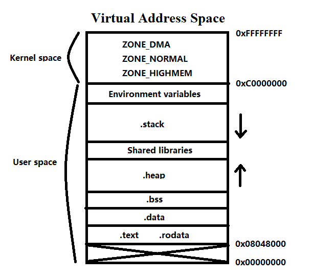

# Virtual Address Space of Process: Memory Partition and Layout

Any programming language is compiled into commands and data. When a program start, it will be loaded from the disk into the memory. However, it won't be loaded into the physical memory directly. Under a x86-32 Linux operating system, current process will be allocated a space of 2^32 bits (4 GB), which is called the virtual address space.



Virtual means that this space does not exists physically, it is just a data structure provided by the system. This virtual space is divided into two parts: user space and kernel space. In default, the user space occupies 3 GB and the kernel space occupies 1 GB.

The memory space from 0x00000000 to 0x0804800 is not allowed to access. A nullptr has a memory address of 0x00000000, so any access of what a nullptr points to will cause a segmentation fault.

```C++
*p = nullptr;
p = p->next; // ERROR
```

On the bottom of the user space it stores *.text* and *.rodata*. *.text* stores commands, and *.rodata* stores read-only data, such us constant string. An error occurs when trying to modify the data stores in this area, for example:

```C++
char *p = "hello world";
*p = 'a';	// ERROR
```

Next address space stores *.bss*, which represents variables without initialization. The system will automatically assign 0 two these variables. It also stores variables which is assigned 0 by programmers.

```C++
int g_data;
cout << g_data << endl;	  // 0
```

Variables declared out side functions are stored as data type. So they are stored inside *.data* or *.bss* depending on whether they are initialized or not. Notice that all local variables declared inside function scope are all compiled into assembly commands instead of data. So they all stored in *.text*. After the function is called, the system will load these commands, and create corresponding spaces on the function stack for these variables. 

```c++
int g_data1 = 10;	// .data
int g_data2 = 0;	// .bss
int g_data3;		// .bss

static int g_data4 = 11;	// .data
static int g_data5 = 0;		// .bss
static int g_data6;			// .bss

int main() {
    int a = 12;		// .text
    int b = 0;		// .text
    int c;			// .text
    
    static int e = 13;		// .data
    static int f = 0;		// .bss
    static int g;			// .bss
}
```

Then there is *.heap*, which stores data created by programmers with new or malloc. Currently it is empty because we haven't create any new memory yet.

Above *.heap* is the area storing shared libraries (*.dll* in Windows and *.so* in Linux). 

Then there is the space called *.stack*. It is the most important part for function calls. Unlike heap, stack grows downward from a larger address to a smaller address.

At the top of the user space it stores terminal parameters and environment variables. For example, in this case 

```shell
./a.out 192.168.1.000 8888
```

the two parameters IP and port will be stored here.

Inside kernel space there are three areas: *ZONE_DMA*, *ZONE_NORMAL* and *ZONE_HIGHMEM*. Kernel space stores data which is essential for operating system.

The user space for each process is private, but the kernel space is shared. That is, if we want to communicate among processes, we have to go through the kernel space. Anonymous channel is a popular way that creates an area inside kernel space for processes to communicate with each others.