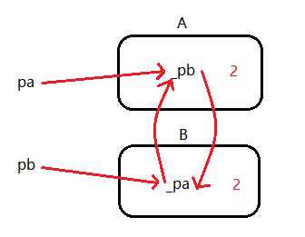

# Smart Pointers with Reference Counting

When using *auto_ptr*, *scoped_ptr* and *unique_ptr*, there can only be one pointer that manages the object at the same time. But with reference counting, multiple smart pointers can manage a same object at the same time. The general idea is to assign a reference count to each object. When a pointer to this object is created, the count is added by 1. When a pointer is destroyed, the count minuses one. When the count becomes 0 which means no pointers are pointing to the object, the memory is released.

Here we defined a *RefCount* class which refers to the reference count.

```cpp
template <typename T>
class RefCount {
 public:
  RefCount(T *ptr = nullptr) : _ptr(ptr) {
    if (_ptr != nullptr) _count = 1;
  }
  void addRef() { _count++; }
  int delRef() { return --_count; }

 private:
  T *_ptr;
  int _count;
};
```

In out *SmartPtr*, we modify its member functions to deal with the reference count properly. Please pay attention to the implementation of the destructor. The object is only destroyed when the count becomes 0.

```cpp
template <typename T>
class SmartPtr {
 public:
  SmartPtr(T *ptr = nullptr) : _ptr(ptr) { _refCount = new RefCount<T>(ptr); }
  ~SmartPtr() {
    if (0 == _refCount->delRef()) {
      delete _ptr;
      _ptr = nullptr;
    }
  }
  T &operator*() { return *_ptr; }
  T *operator->() { return _ptr; }
  SmartPtr(const SmartPtr<T> &other) {
    _ptr = other._ptr;
    _refCount = other._refCount;
    if (_ptr != nullptr) _refCount->addRef();
  }
  SmartPtr<T> &operator=(const SmartPtr<T> &other) {
    if (this == &other) return *this;
    if (0 == _refCount->delRef()) {
      delete _ptr;
    }
    _ptr = other._ptr;
    _refCount = other._refCount;
    _refCount->addRef();
    return *this;
  }

 private:
  T *_ptr;
  RefCount<T> *_refCount;
};
```

Our self-defined smart pointer has the problem of thread safety. The count may not be modified correctly with multithread. The C++ memory library use atomic operations for reference counting.

## *shared_ptr*

*shared_ptr* is the smart pointer with reference counting in memory library. However, there is a problem with *shared_ptr* which is known as the cross-reference problem. Let's look at the following example. We have two classes *A* and *B*. In class *A* we have a *shared_ptr* of type *B*, while in class *B* we have a *shared_ptr* of type *A*.

```cpp
class B;
class A {
public:
    A() {
        cout << "A()" << endl;
    }
    ~A() {
        cout << "~A()" << endl;
    }
    shared_ptr<B> _pb;
};
class B {
public:
    B() {
        cout << "B()" << endl;
    }
    ~B() {
        cout << "~B()" << endl;
    }
    shared_ptr<A> _pa;
};
```

Now in the main function we created two objects of *A* and *B* respectively. Then we let the pointer in *pa* point to *pb*, and let the pointer in *pb* point to *pa*. Then if we print out the reference count of these two objects, we find that the counts are both 2. However, we only have one pointer pointing to each object in *main()*. Therefore, the memory is not deallocated properly, which will cause a memory leak.

```cpp
int main() {
    shared_ptr<A> pa = new A();
    shared_ptr<B> pb = new B();
    pa->_pb = pb;
    pb->_pa = pa;
    cout << pa.use_count() << endl;	// 2
    cout << pb.use_count() << endl;	// 2
    return 0;
}
```



## *weak_ptr*

To fix this problem, we can use *weak_ptr* instead. As you can see from the name, a *weak_ptr* is weak because it does not have the ownership of the object. A *weak_ptr* acts like a observer, which will not change the reference count of the recourse, but can only examine if the object exists or not.

Here we can change the member variables of *A* and *B* into *weak_ptr*.

```cpp
class B;
class A {
public:
    A() {
        cout << "A()" << endl;
    }
    ~A() {
        cout << "~A()" << endl;
    }
    weak_ptr<B> _pb;
};
class B {
public:
    B() {
        cout << "B()" << endl;
    }
    ~B() {
        cout << "~B()" << endl;
    }
    weak_ptr<A> _pa;
};
```

However, since *weak_ptr* doesn't have the ownership of an object, obviously it cannot access any methods of the object as well. Therefore, if we have a function *foo()* inside *A*, and a function *bar()* inside *B* which calls *A::foo()* with the *weak_ptr*, there will be an error.

```cpp
class A {
    ...
    void foo() {
        // Do something here
    }
};
class B {
    ...
    void bar() {
        _pa->foo();	// ERROR
    }
}
```

In order to access the object methods with a *weak_ptr*, we need to use an upgrade function *lock()*. This function try to upgrade a *weak_ptr* into a *shared_ptr*. If the object exists, a *shared_ptr* to the object will be returned and corresponding methods can be called through it. If the object doesn't exist, a *nullptr* is returned instead.

```cpp
class B {
    ...
    void bar() {
        shared_ptr<A> p = _pa.lock();
        if (p != nullptr)
   			p->foo();
    }
};
```

