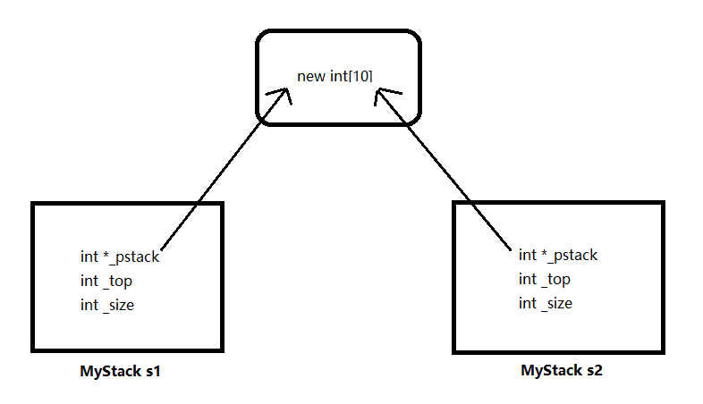

# Shallow Copy and Deep Copy

Now let's continue with our MyStack class. Suppose we create a MyStack object s1, and use it to create two other stacks s2 and s3, with either operator `=` or brackets. 

```cpp
int main() {
    MyStack s1(10);
    MyStack s2 = s1;
    MyStack s3(s1);
    return 0;
}
```

By doing this, the compiler will create a **copy constructor** for us, which simply copy the memory space of s1 to s2 and s3. But the program crashes while running, the following image explains why.




Here in s1 we have a member variable **_pstack* which points to an array we created on the heap. By copying the memory space of s1, s2 has an identical pointer *\*_pstack*  which points to the same array. When the function returns, it first calls s2's destructor, which destroys the array object. But when the destructor of s1 is called, the memory is already destroyed, so a illegal memory access happened.

The behavior of copying the memory space is called a **shallow copy**. In some cases a shallow copy is safe and sufficient, but when the object occupies external resources, the shallow copy will cause problems.

To fix this, we may use a **deep copy** instead. To achieve this, we can define the copy constructor by our own:

```cpp
MyStack(const MyStack &other) {
    _pstack = new int[other._size];
    for (int i = 0; i < _size; i++) {
        _pstack[i] = other._pstack[i];
    }
    _top = other._top;
    _size = other._size;
}
```

The copy constructor has the same name as the class and no return value. It takes a reference to an object of this class as parameter. In the code above, we allocate new memory for the array, and manually copy all the element into it.

Now suppose we create two stacks, s1 and s2 with the constructor. And we want to override s2 with s1, with the operator `=`. 

```cpp
int main() {
    MyStack s1(10);
    MyStack s2(10);
    s2 = s1;
    return 0;
}
```

The default behavior of such assignment is also a shallow copy, which causes problem in releasing memory. And in addition, it will also cause a memory leak, because s2's array pointer loses its control of the array on the heap.

We can also define the operator `=` in the way we want, which is called an **operator override**.

```cpp
MyStack& operator=(const MyStack &other) {
    if (this == &other)
        return *this;
    // 1. Release current memory
    	delete[] _pstack;
    // 2. Allocate new memory
     _pstack = new int[other._size];
    for (int i = 0; i < _size; i++) {
        _pstack[i] = other._pstack[i];
    }
    _top = other._top;
    _size = other._size;
    
    return *this;
}
```

The function name of an operator override is the keyword `operator` plus the symbol. It also takes a reference to an object of this class as parameter. The return value can be *void*, but in most cases we return a reference to the current object **this*. In this way we can achieve the relay of assignments, for example `s1 = s2 = s3`.

We need to do two things in the override of operator `=`. First, we need to release the memory of the current object. But what if we assign an object to itself? Then its memory is released and can not go on. In preventing this, we need to check if the object on the right side is the current object. Then we can do the deep copy as before.


