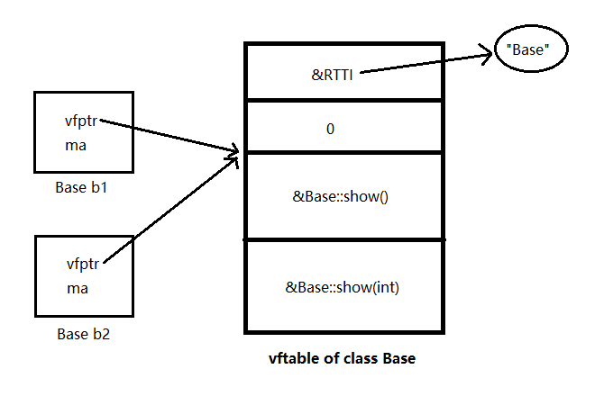
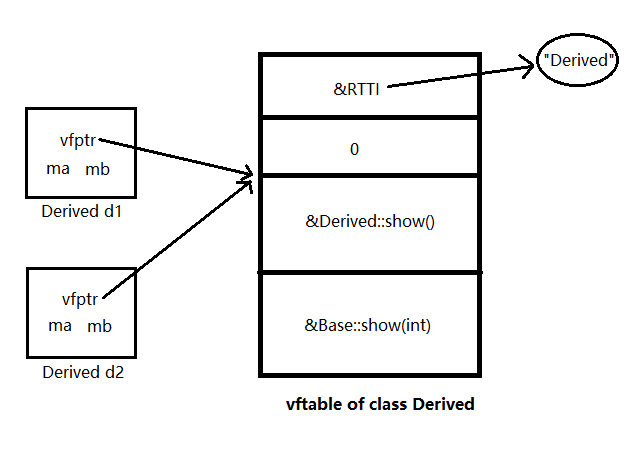

# Virtual Functions, Static Binding and Dynamic Binding

### Static Binding

Now suppose we have these two classes. Class *Base* has two methods *show()* and *show(int)*, and class *Derived* has one method *show()*.

```cpp
class Base {
public:
    Base(int data = 10) : ma(data) {}
    void show() {
        cout << "Base::show()" << endl;
    }
    void show(int) {
        cout << "Base::show(int)" << endl;
    }
protected:
    int ma;
};

class Derived : public Base {
public:
    Derived(int data = 20) : Base(data), mb(data) {}
    void show() {
        cout << "Derived::show()" << endl;
    }
private:
    int mb;
};
```

In the main function, we defined a *Base* pointer, but pointing to a *Derived* object. Now if we call *show()* and *show(int)* with the pointer, what will the output be?

```cpp
int main() {
    Derived d(50);
    Base *pb = &d;
    pb->show();
    pb->show(10);
    cout << sizeof(Base) << endl;
    cout << sizeof(Derived) << endl;
    cout << typeid(pb).name() << endl;
    cout << typeid(*pb).name() << endl;
    return 0;
}
```

The output shows as follow. In this case, the *Base* version of *show()* and *show(int)* will be called. And we can also find out that the dereference of *pb* is type *Base* instead of type *Derived*.

```
Base::show()
Base::show(int)
4
8
class Base*
class Base
```

This behavior is called **static binding**, which indicates that the functions to be called are determined while compiling. In the example above, the compiler figures out that *pb* is of type *Base*, so every call with *pb* refers to the call of methods within *Base*, which can be shown in the assembly code:

```assembly
call Base::show (01612DAh)
call Base::show (01612B2h)
```

### Virtual Functions

In Object-Oriented Programming, **polymorphism** means that a call to a member  function will cause a different function to be executed depending on the type of object that invokes the function. In C++, we can achieve this by marking a function as `virtual`:

```cpp
class Base {
public:
    Base(int data = 10) : ma(data) {}
    virtual void show() {
        cout << "Base::show()" << endl;
    }
    virtual void show(int) {
        cout << "Base::show(int)" << endl;
    }
protected:
    int ma;
};
```

If a virtual function is defined in the class, the compiler generates a unique **virtual function table** (vftable) for this class during compilation. There are three things stored in a vftable: an RTTI (Runtime Type Information) pointer which pointing to the class name, an offset which is used in multiple inheritance, and the address of the virtual functions in the class. When the program is running, every vftable will be loaded into the *.rodata* area of the program virtual memory space which stores read-only information.

Now in class *Base*, 4 extra bytes should be used to store the **virtual function pointer** (vfptr), which points to the start location of the virtual function addresses in vftable. For different objects in the same class, their vfptrs point to the same vftable. Therefore, the number of virtual functions in a class does not affect the memory size of the objects, they only affect the size of the virtual function table.



### Function Overriding

If a method in the derived class is exactly the same as a method inherited from the base class (function name, return value and parameter list), and this base method is marked `virtual`, then the method in the derived class automatically  becomes a virtual function, and override its base function. This feature is known as **function overriding**. Notice that overriding refers to the overriding of virtual function addresses in the derived virtual function table, as shown below. In the example at the beginning, *Derived::show()* overrides *Base::show()*, so it replace its corresponding place in the vftable.



### Dynamic Binding

During compiling, if the compiler finds the base method to be a normal function, it binds its function address statically. However, if the base method is a virtual function, a **dynamic binding** will be done.

Dynamic binding refers to the function calls during runtime. Unlike static binding, the specific memory address of the called function is unknown until it is called. The compiler implement dynamic binding by first inquiring the function address stored in vftable using the vfptr of the object, and then call the corresponding function with the address, as shown in the assembly code:

```assembly
mov eax, dword ptr[pb]
mov ecx, dword ptr[eax]
call ecx
```

And the output of the example above shows as follow. Notice the changes in the functions called and the object size.

```
Derived::show()
Base::show(int)
8
12
class Base*
class Derive
```

Moreover, if a class has a vftable, then the type of what its pointer pointing to is also a runtime type, which is stored in RTTI. In this case, **pb* refers to class *Derived*.

### Function Overriding and Function Hiding

Function overriding and function hiding is sometimes easy to be confused, so their differences is summarized as follow:

Function overriding refers to the overriding of function addresses in the virtual function table. The two functions have to follow:

1. Located in the base class and the derived class respectively.
2. Their function names, return values and parameter lists are the same.
3. The function of the base class is marked as `virtual`.

Function hiding refers to that the function within the scope of the derived class hides the function within the scope of the base class. There are two cases:

1. The function of the derived class has the same function name as the one of the base class, but with different parameters.
2. The function of the derived class has the same function name and parameters as the one of the base class, but the function of the base class is not marked as `virtual`.

Moreover, function hiding is static (compile time), while function overriding is dynamic (runtime).