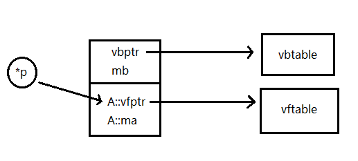

# Virtual Inheritance and Virtual Base Classes

Multiple inheritance means that a class can inherit from multiple base classes. **Virtual Inheritance** is a kind of inheritance that is widely used in multiple inheritance, by adding `virtual` before the access modifiers:

```cpp
class A {
public:
private:
    int ma;
};

class B : virtual public A {
public:
private:
    int mb;
};
```

A class that is virtual inherited is a **virtual base class**. In this case, class *A* is a virtual base class. What is the difference between a virtual inheritance and a normal inheritance? The answer is the memory layout. In a normal inheritance, member variables of the base class locate at the front of the memory, and then goes the member variables of the derived class. But in a virtual inheritance, all the member variables of the base class is moved to end of the memory. What's more, the original location of these variables are replaced with a **virtual base pointer** (vbptr).


Just like vfptr, vbptr points to a **virtual base table** (vbtable). vbtable stores an upward offset which is 0 in this case, and the distance to the member variables of the base class. Here since *A::ma* moves to the end, the distance to its original location (where vbptr locates) is 8. Now class *B* needs an extra 4 bytes to store the vbptr, so its size is 12 bytes comparing to 8 in normal inheritance.

Now if class *A* has a virtual member function, and *B* virtually inherits from A:

```cpp
class A {
public:
    virtual void func() {
        cout << "A::func()" << endl;
    }
private:
    int ma;
};

class B : virtual public A {
public:
    void func() {
        cout << "B::func()" << endl;
    }
private:
    int mb;
};
```

In the main function, we use an *A* pointer to point to a *B* object on the heap, then calls *func()* with the pointer. The program outputs normally, but you may have an error while deleting *B*. Why's that.

```cpp
int main() {
    A *p = new B();
    p->func();	// B::func()
    delete p;	// ERROR
    return 0;
}
```

Notice that if we use a base pointer to point to a derived object, the pointer will always point at the start point of the base members. In this case, *\*p* points at the vfptr of *A*. But since it is a virtual inheritance here, all members of *A* is moved to the end, and its original location is replaced with a vbptr. Now what happens when are deleting through *\*p*?



It is kinda problematic and hard to figure out if you are using Visual Studio. But fortunately, g++ or clang++ have optimized accordingly and have no problem freeing the memory.

> Another good reason not to use Windows for development.